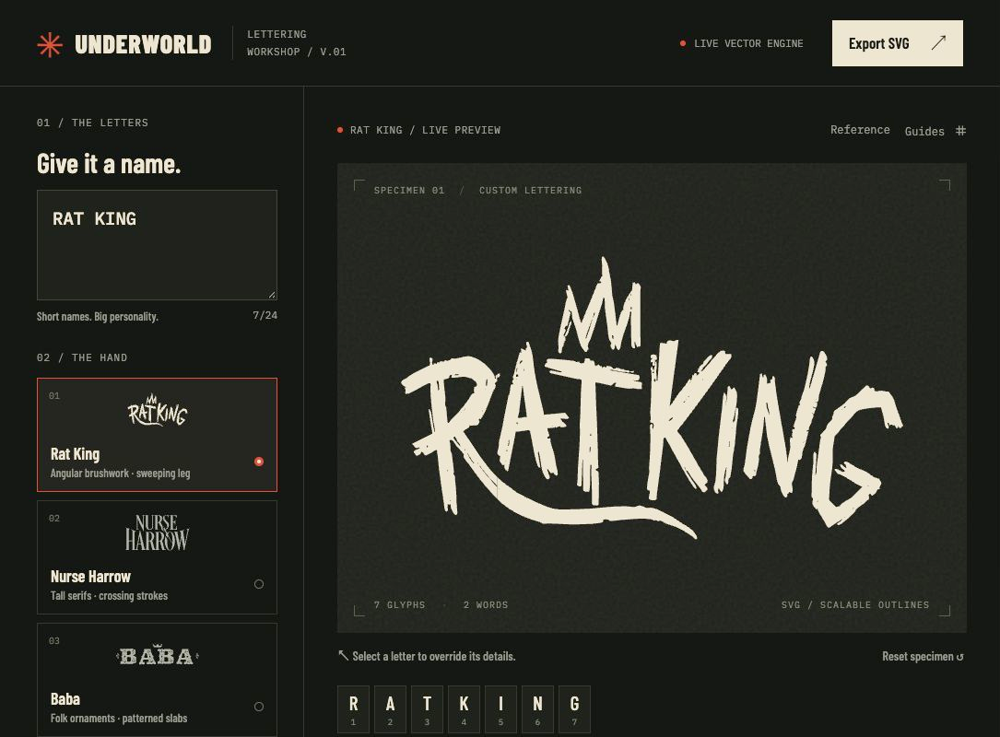
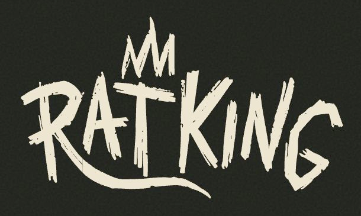
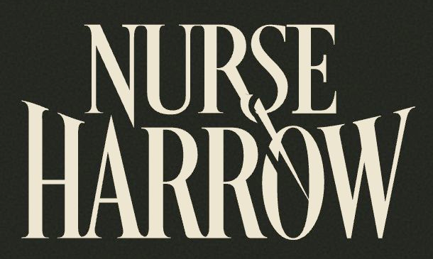
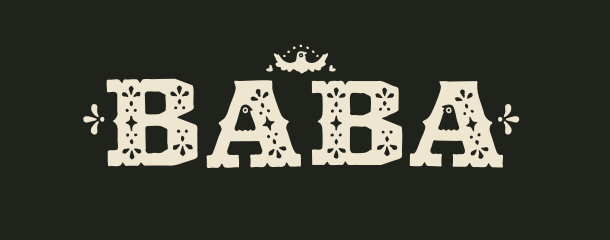
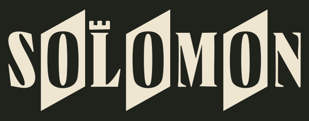
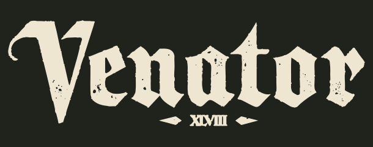
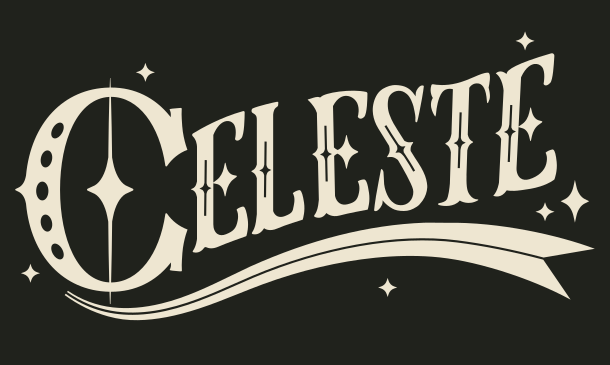
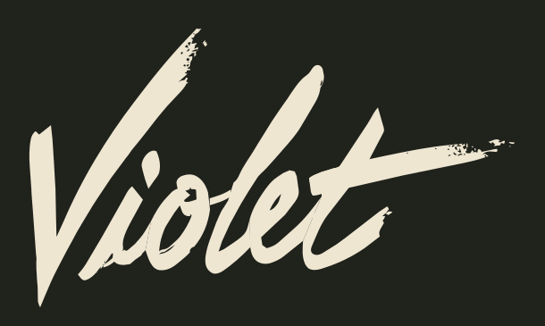
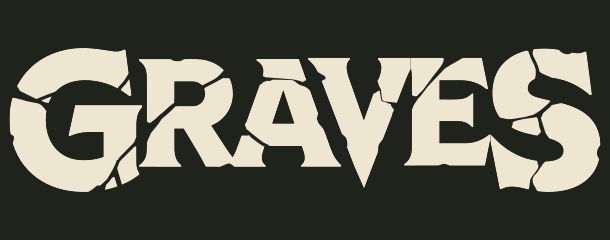

# Underworld Lettering

_Deadlock_ is by far my favorite game of the decade for its unique and distinctive art direction, which inspired me to create this project.

An experimental typography workshop for industrial, punk, underground wordmarks. Type a short name, choose a hand, and see an SVG composition update instantly.

Built with **Svelte 5**, **Vite**, **TypeScript 7**, and **Bun**, with a small lexer/parser and vector layout engine. Inspired by the individual hero wordmarks in Valve’s _Deadlock_.



## Features

- Eight distinct lettering packs: **Rat King**, **Nurse Harrow**, **Baba**, **Solomon**, **Venator**, **Celeste**, **Violet**, and **Graves**.
- Instant previews for names of up to 24 letters or digits.
- An R leg that adapts to the width of its word.
- Crowns, decorative I dots, alternate letters, uneven heights, spacing, and ink controls.
- Global switches and per-letter overrides, from the preview or letter selector.
- Optional inline syntax and visible parser output.
- Side-by-side reference comparison and layout guides.
- Standalone SVG export with embedded outlines; exported lettering needs no installed fonts.

## Run locally

Requires **Bun 1.4.2** (pinned in `.bun-version` and `package.json`). Install it from [bun.sh](https://bun.sh/).

```sh
bun install --frozen-lockfile
bun run dev
```

Open the local URL printed by Vite. `bun.lock` pins dependencies. TypeScript 7.0.2 is installed as `@typescript/native`; Svelte diagnostics also require the TypeScript 6.0.3 compatibility API. `bun run check` uses TypeScript 7 for both Svelte and standalone TypeScript checks.

```sh
bun run format  # Apply formatting
bun run check   # Formatting, typechecking, and lint
bun test        # Parser, layout rules, and override precedence
bun run build   # Static production build in dist/
```

The production output can be hosted by any static web server. Rendering runs entirely in the browser. Interface fonts currently load from Google Fonts; the lettering engine does not make network requests.

## Deploy with GitHub Actions

[`.github/workflows/deploy.yml`](.github/workflows/deploy.yml) runs on every push to `main`, or manually from the Actions tab on `main`:

1. Set up the pinned Bun version and install with `bun install --frozen-lockfile`.
2. Run `bun run check` (formatting, types, lint), then `bun test`.
3. Build the app for the GitHub Pages base path and upload `dist/`.
4. Deploy to GitHub Pages only after all earlier steps pass.

In the repository's **Settings → Pages → Build and deployment**, select **GitHub Actions** as the source. Commit the workflow and app changes, then push to `main`. In **Actions → Check and deploy**, verify that both jobs succeed; the deployment job links to the published site. The default URL is [hmrguez.github.io/underworld-lettering/](https://hmrguez.github.io/underworld-lettering/).

The workflow uses GitHub's automatic token; no deployment secret is required. Reference artwork uses Vite's base URL so it also loads from the repository subpath. To verify that build locally:

```sh
bun run build -- --base /underworld-lettering/
bun --bun vite preview --host 127.0.0.1 --base /underworld-lettering/
```

Open the preview URL with `/underworld-lettering/` appended and enable Reference comparison to check artwork loading.

## Letter-level syntax

Type plain text or attach settings immediately after a letter:

```text
R[swash=word]AT KI[dot=crown]NG
R[swash=off]AVEN
I[dot=star]
B[variant=alt]ABA
S[plate=on]OL[rook=off]OMON
V[initial=off]ENATOR
AV[variant=alt]A
C[initial=off,swash=off]ELESTE
S[initial=on,ornament=off]TAR
G[fracture=off]RAV[fracture=on]ES
```

| Setting    | Values                         |
| ---------- | ------------------------------ |
| `swash`    | `auto`, `word`, `off`          |
| `dot`      | `auto`, `crown`, `star`, `off` |
| `variant`  | `auto`, `base`, `alt`          |
| `ornament` | `auto`, `on`, `off`            |
| `plate`    | `auto`, `on`, `off`            |
| `initial`  | `auto`, `on`, `off`            |
| `fracture` | `auto`, `on`, `off` (Graves)   |
| `rook`     | `auto`, `on`, `off`            |

Multiple settings can share a bracket, separated by commas. Settings apply when the style and letter support them. Interface overrides take precedence over inline settings; inline settings take precedence over automatic behavior. Editing the source clears interface overrides.

Input supports A–Z, digits, spaces, hyphens, and apostrophes. Lowercase is normalized to uppercase. Invalid syntax produces a diagnostic while valid letters continue to render.

## Eight hands

### Rat King

Angular brushwork, fractured edges, an adaptive R swash, and a crown. R, A, T, K, I, N, and G use reference-derived vector outlines. Other capitals use inferred brush designs; digits and punctuation use fallback outlines.



### Nurse Harrow

Tall, high-contrast serifs, two-line compositions for multiple words, and an R flourish crossing into the lower line. N, U, R, S, E, H, A, O, and W come from the reference; missing glyphs use Cormorant Garamond outlines.



### Baba

Decorated slab letters, folk ornaments, and alternate A/B shapes. A and B use reference-derived outlines. Other glyphs use Rye outlines with additional decorative treatment.



### Solomon

Tall, narrow serif capitals and independent slanted plates with transparent reversed ink. Plates default to even positions (2, 4, 6), with an odd/even phase switch restarting per word. The rook has its own switch and per-letter overrides; automatic placement uses the first L in each word, or its middle letter when no L exists. When its letter has a plate, the rook rises above that plate.

S, O, L, M, N and the rook use extracted reference contours, including three O variants. Other capitals are custom inferred geometry with heavy stems, thin connectors and wedge serifs. Digits use compressed Cormorant Garamond fallback outlines. Spacing and plates are reconstructed; unseen letters are not claimed as exact.



### Venator

Heavy blackletter with angular shoulders, broken bowls, narrow counters and pointed terminals. V, E, N, A, T, O and R retain the reference contours and native wear. The hooked V is contextual at word starts; `initial=on|off|auto` controls it. `variant=base` chooses an inferred compact v, while `variant=alt` forces the reference V anywhere. Other inferred letters offer pointed-shoulder alternates; the remaining source letters have a single evidenced form.

Diamonds and **XLVIII** have independent switches. The inscription defaults off and is reference-specific, even for the Venator preset. `ornament=on|off|auto` on the first letter controls the diamond pair. Spacing uses measured ink profiles and protects an 8-unit minimum clearance. Missing letters, numerals, punctuation and the compact v are custom inferred outlines; no additional font is used.



### Celeste

An oversized decorated initial contrasts with narrow, curved serif letters on an ascending baseline. The first letter of the first word is decorated automatically; `initial=on|off|auto` can force or suppress it on any capital. C keeps the reference contour; other initials enlarge their own shapes and use inferred decoration. Turning the initial off selects an inferred compact C.

Stars and interior details have a global switch and per-letter `ornament` overrides. Each word gets an independent double underline; `swash=word|off|auto` on its first letter controls it, with a reach slider. The ribbon bodies adapt to composed width while preserving vertical thickness and fixed terminal proportions; short words use shallower curves. Interface overrides win over inline settings and clear when text changes.

C, E, L, S and T, three E contours, the source interior details, dots, stars and ribbon templates are extracted from the verified Celeste wordmark. Missing letters, digits, punctuation, compact C and non-C initial treatments are inferred specifically for this hand, without a new font. The unseen alphabet is not an exact reconstruction; spacing, multiple-word layout, star placement and adaptive underlines are interpretations.



## How it works

```text
source text
    ↓
lexer → tokens and source positions
    ↓
parser → words, glyphs, modifiers, diagnostics
    ↓
style pack → outlines, metrics, alternate shapes
    ↓
layout + contextual rules → flourishes and ornaments
    ↓
SVG → instant preview / export
```

- `src/lib/parser.ts`: lexer, parser, validation, and modifiers.
- `src/lib/engine.ts`: style selection, layout, contextual flourishes, and SVG generation.
- `src/lib/reference-paths.json`: extracted reference paths.
- `src/lib/inferred-rat-paths.json`: inferred angular brush capitals.
- `src/lib/solomon.ts` and `src/lib/solomon-paths.json`: Solomon geometry, plates, masks and rook rules.
- `scripts/extract-solomon.py`: reproducible reference contour extraction (Python standard library).
- `src/lib/venator.ts`, `src/lib/venator-paths.json` and `scripts/extract-venator.py`: Venator contours, inferred geometry, measured ink profiles and independent ornaments.
- `src/lib/violet.ts`, `src/lib/violet-paths.json` and `scripts/extract-violet.py`: split Violet outlines, inferred pressure ribbons, contextual shaping and controlled script joins.
- `src/lib/celeste.ts`, `src/lib/celeste-paths.json` and `scripts/extract-celeste.py`: separate Celeste contours, custom inferred glyphs, contextual initials and adaptive ribbon curves.
- `src/lib/graves.ts`, `src/lib/graves-paths.json` and `scripts/extract-graves.py`: reference fragments, reconstructed intact envelopes, inferred heavy serifs and ink-fitted fractures.
- `src/lib/fallback-paths.json`: precomputed fallback font outlines.
- `scripts/design-rat-glyphs.cjs`: regenerates the inferred Rat King capitals.
- `src/App.svelte`: editor, preview, settings, and export.
- `tests/engine.test.ts`: parsing and rendering behavior checks.

The renderer composes glyph geometry rather than swapping in a finished name image. Flourishes respond to the surrounding word; the same engine renders presets and arbitrary input.

### Violet

A dramatic brush V followed by connected, forward-slanting lowercase forms. The parser keeps uppercase source characters; Violet shapes the first alphabetic letter of each word as a capital and the remaining letters as lowercase. Selection IDs and source offsets stay intact. Hyphens, apostrophes, digits and word breaks interrupt connections.

The **Extended strokes** switch controls the V treatment, t crossbar and contextual word endings; **Swash reach** changes crossbar/end-stroke reach. **Subtle brush wear** adds selective transparent scratches. Native reference wear remains in the source contours. Per-letter `initial` controls capital/lowercase form, `swash` controls extension, `ornament` controls extra wear, and `variant=base` disengages adjacent joins (`alt` restores contextual eligibility). Interface overrides take priority over inline settings, including explicit automatic values; text edits clear them.

Default spacing connects reachable shoulders using measured entry/exit points and pair-dependent curves. Tight spacing is clamped; spacing at +50 and above disengages joins and uses separate entries/endings. The original V remains deliberately separate from its following i. Extended t crossbars can pass over neighboring ascenders; the model is controlled script composition rather than a general collision solver.

Reference-derived: **V**, lowercase **i, o, l, e, t**, their visible pressure variation and dry-brush contours. The connected source outline is split at reconstructed shoulder cuts, with an independent t crossbar. All other capitals/lowercase, numerals, punctuation, joins and contextual endings are inferred. The shortened V is also inferred. These cleaner pressure-based outlines interpret the visible hand; they do not reconstruct Valve's unseen alphabet. No new font is bundled.



### Graves

Heavy, compact serif masses with angular counters and unequal structural breaks. **Structural fractures** controls automatic cracks; **Fracture intensity** ranges from 40–100% and defaults to the inspected reference width. Per-letter Automatic / Intact / Fractured uses the narrow syntax `fracture=auto|off|on`. Intact overrides remove structural breaks independently of the global switch; explicit fractured overrides work with the switch off. Existing precedence and text-edit reset rules apply.

G, R, A, V, E and S retain visible source fragments and first-occurrence fractures. Repeated letters use three deterministic patterns, selected by character and occurrence and fitted to connected ink runs. Cut widths are capped to protect stems and counters. Cracks subtract through transparent SVG masks and export correctly over arbitrary backgrounds. No font is needed.

Intact envelopes, the shared R/A, V/E and E/S boundaries, spacing and repeat patterns are reconstructed. Every other capital, all digits and punctuation are custom inferred heavy serif geometry, distinct from Baba's patterned slabs. The unseen alphabet is an interpretation, not an exact Valve reconstruction. Native small contour nicks remain separate from structural fractures; no random surface texture is added.



## Scope and fidelity

This is a personal v1 experiment, not a complete reconstructed font family. Original hero names are close to the references. Letters absent from those references are inferred, and the interface labels them. Spacing and some ornament placement are reconstructed. There is no manual Bézier editor, font uploader, or OpenType font export.

## References and attribution

- Graves artwork: **Valve**, [official Graves poster](https://cdn.fastly.steamstatic.com/apps/deadlock/images/react/oldgods/splash_graves.png) on [Old Gods, New Blood](https://www.playdeadlock.com/oldgods); [isolated necro wordmark](https://deadlockskins.gg/hero-wordmarks/necro.svg) via [DeadlockSkins.gg](https://deadlockskins.gg/blog/deadlock-old-gods-new-blood-update). Actual poster and vector contents were inspected. See [visual verification](docs/VISUAL-VERIFICATION.md) for reconstruction boundaries and evidence.

- Violet artwork: **Valve**, [official Violet poster](https://cdn.fastly.steamstatic.com/apps/deadlock/images/react/cityneversleeps/hero_violet.webp) on [City Never Sleeps](https://www.playdeadlock.com/cityneversleeps); [isolated artist wordmark](https://deadlockskins.gg/hero-art-provisional/artist-wordmark.svg) via [DeadlockSkins.gg](https://deadlockskins.gg/blog/deadlock-city-never-sleeps-update). Actual image contents were verified. See [visual verification](docs/VISUAL-VERIFICATION.md) for provenance and evidence.
- Visual direction and original hero lettering: **Valve**, [Deadlock — City Never Sleeps](https://www.playdeadlock.com/cityneversleeps).
- Celeste artwork: **Valve**, [official Celeste poster](https://cdn.fastly.steamstatic.com/apps/deadlock/images/react/oldgods/splash_celeste.png) on [Old Gods, New Blood](https://www.playdeadlock.com/oldgods); [isolated unicorn wordmark](https://deadlockskins.gg/hero-wordmarks/unicorn.svg) via [DeadlockSkins.gg](https://deadlockskins.gg/blog/deadlock-old-gods-new-blood-update). Extraction and fidelity limits are recorded in [visual verification](docs/VISUAL-VERIFICATION.md).
- Venator artwork: **Valve**, [Old Gods, New Blood](https://www.playdeadlock.com/oldgods); [isolated priest wordmark](https://deadlockskins.gg/hero-wordmarks/priest.svg) via [DeadlockSkins.gg](https://deadlockskins.gg/blog/deadlock-old-gods-new-blood-update). No commercial blackletter font is bundled.
- Solomon asset verification and regression results: [visual verification](docs/VISUAL-VERIFICATION.md). The official asset filenames currently mismatch their artwork; Solomon is visible in `hero_baba.webp?v=2`, while `hero_solomon.webp` shows Deadman Danny.
- Isolated reference SVGs: [DeadlockSkins.gg](https://deadlockskins.gg/blog/deadlock-city-never-sleeps-update), stored in `public/references/`.
- Fallback outline sources: [Cormorant Garamond](https://github.com/google/fonts/tree/main/ofl/cormorantgaramond), [Rye](https://github.com/google/fonts/tree/main/ofl/rye), and [Sedgwick Ave](https://github.com/google/fonts/tree/main/ofl/sedgwickave). SIL Open Font License texts are included in `public/references/`.
- Interface fonts: Barlow Condensed and IBM Plex Mono via Google Fonts.

This project is unofficial and is not affiliated with Valve. Bundled reference artwork and reference-derived glyphs remain third-party material; this repository does not claim ownership of them or grant a license to them. No blanket license is applied to the repository.
